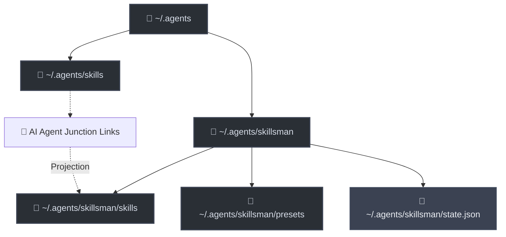

# 🛠️ skillsman

[](https://nodejs.org/)
[](package.json)
[](docs/developer_guide.md)
[](LICENSE)
[](#)

`skillsman` is a lightweight, high-performance Node.js CLI utility designed to manage, structure, and dynamically swap presets (assemblies) of portable **AI Agent Skills** conforming to the Anthropic Agent Skills specification.

By utilizing smart symbolic links (Unix symlinks / Windows Directory Junctions) to project active files into `~/.agents/skills/` on-the-fly, `skillsman` eliminates folder cloning chaos and offers cycle-safe recursive references, conflict resolution, and global blacklisting out-of-the-box.

---

## 🗺️ Architecture and Concept

`skillsman` acts as a smart projection layer between your physical skills store and active AI agents (like Claude Code, Cursor, Cline, Copilot, etc.).



---

## 📚 Documentation Directory

To keep documentation clean and readable, technical details have been separated into dedicated guides:

*   📘 [**User Guide** (docs/user_guide.md)](docs/user_guide.md) — Detailed explanation of folder structures, CLI command reference syntax, DFS recursive resolution, conflict overrides, and how `never.md` blacklisting priority is applied.
*   💻 [**Developer Guide** (docs/developer_guide.md)](docs/developer_guide.md) — Local repository setup, CommonJS programmatic APIs, codebase map (`index.js`), and built-in **Node.js Native Test Runner** (`node:test`) guides.

---

## ⚡ Quick Start

### 1. Installation
Clone this repository and link it globally so it's available system-wide:
```bash
git clone https://github.com/youruser/skillsman.git
cd skillsman
npm install
npm link
```

### 2. Initialization
Run the initialization routine. It creates standard workspaces inside `~/.agents/` and performs a safe physical migration of any pre-existing skills into the source library:
```bash
skillsman init
```

### 3. List Available Presets
List all pre-built assemblies with their description and unique skill counts:
```bash
skillsman list
```

### 4. Activate Presets
*   **Absolute Activation**: Link only specific presets (e.g. `dev` and `planning`):
    ```bash
    skillsman use dev planning
    ```
*   **Incremental Activation**: Add or remove skills from active sets on-the-fly:
    ```bash
    skillsman activate docs
    skillsman deactivate marketing
    # Or shorthand syntax:
    skillsman use +docs -marketing
    ```
*   **Force Synchronization**: Sync active folder symlinks to match the exact current configuration of `state.json` (great after manually editing preset files):
    ```bash
    skillsman use
    ```

---

## 📝 License

Distributed under the [MIT](LICENSE) License. Copyright (c) 2026 Alexander Radchenko.
