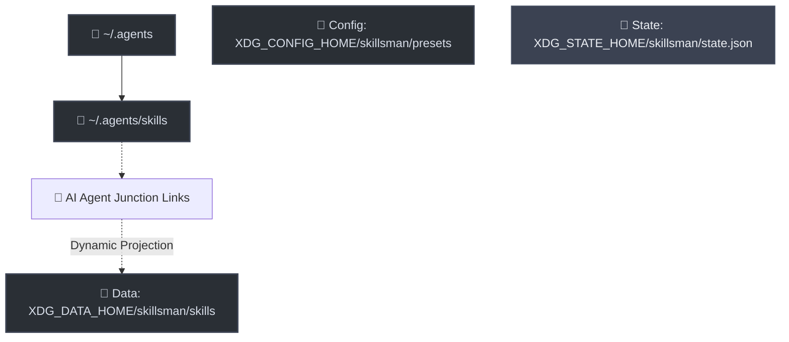

# 🛠️ skillsman

[](https://nodejs.org/)
[](package.json)
[](https://github.com/AlexRadch/skillsman/actions/workflows/test.yml)
[](LICENSE)
[](https://github.com/AlexRadch/skillsman)

`skillsman` is a lightweight, high-performance Node.js CLI utility designed to manage, structure, and dynamically swap presets (assemblies) of portable **AI Agent Skills** conforming to the Anthropic Agent Skills specification.

By acting as a **Unified CLI wrapper** and drop-in enhancement for the official `skills` tool, `skillsman` lets you use the standard `skills` commands while supercharging them with native preset management, directory isolation, and zero-conflict link management.

---

## 🗺️ Architecture and Concept

`skillsman` acts as a smart, zero-conflict projection layer between your physical skills store and active AI agents (like Claude Code, Cursor, Cline, Copilot, etc.), strictly conforming to the cross-platform **XDG Base Directory Specification**:



### 📍 XDG Paths Resolution Table

| Directory Type | Linux / macOS Default | Windows Default | Environment Variable |
| :--- | :--- | :--- | :--- |
| **Presets (Config)** | `~/.config/skillsman/presets/` | `AppData\Roaming\skillsman\presets\` | `XDG_CONFIG_HOME` |
| **Active Preset State** | `~/.local/state/skillsman/state.json` | `AppData\Local\skillsman\state.json` | `XDG_STATE_HOME` |
| **Skills Library (Data)** | `~/.local/share/skillsman/skills/` | `AppData\Local\skillsman\skills\` | `XDG_DATA_HOME` |
| **Active Projections** | `~/.agents/skills/` | `~/.agents/skills/` | *Fixed Zone* |

---

## 💎 Key Features

* 🚀 **10x Faster Execution**: Delegated commands run directly through Node.js on the compiled dependency bundle, bypassing `npx` and network/shell overhead entirely.
* 📦 **Automatic Skill Ingestion**: Scanning and migrating physical skill folders into the isolated library on-the-fly, generating clean presets automatically.
* 🔄 **Cycle-Safe DFS Traversal**: Resolving nested preset dependencies recursively using a cycle-safe Depth-First Search algorithm.
* 🤝 **Conflict Resolution**: Preventing breaking linkages when multiple active presets share identical skill names.
* 🚫 **Global Blacklist Priority**: Applying the designated `never.md` preset as a final filter block to prevent forbidden skills from projecting.

---

## 📚 Documentation Directory

Technical details and developer instructions have been separated into dedicated guides:

* 📘 [**User Guide** (docs/user_guide.md)](docs/user_guide.md) — Directory layout, CLI command reference syntax, DFS resolver, conflict overrides, and how `never.md` blacklisting priority is applied.
* 💻 [**Developer Guide** (docs/developer_guide.md)](docs/developer_guide.md) — Local development, production dependencies, modular programmatic API (`index.js`), test architecture, and built-in **Node.js Native Test Runner** (`node:test`) details.

---

## ⚡ Quick Start

### 1. Installation

Install `skillsman` globally from NPM. This registers both global `skillsman` and `skills` executables on your system:

```bash
npm install -g skillsman
```

If you ever install the official CLI and it overwrites the commands, simply run `npm install -g skillsman` to route them back through `skillsman` safely.

### 2. Ingest Existing Skills

Scan and migrate physical skill folders from your active agent directory (`~/.agents/skills/`) to your isolated local library:

```bash
skillsman collect
```

This automatically generates a matching preset file under your config folder for every migrated skill.

### 3. List Available Presets

List all pre-built assemblies with their descriptions and unique resolved skill counts:

```bash
skillsman presets
```

### 4. Activate Presets

* **Absolute Activation**: Link only specific presets (e.g. `dev` and `planning`):

    ```bash
    skillsman use dev planning
    ```

* **Incremental Activation**: Add or remove skills from active sets on-the-fly:

    ```bash
    skillsman activate docs
    skillsman deactivate marketing
    # Or shorthand syntax:
    skillsman use +docs -marketing
    ```

* **Force Synchronization**: Sync active folder symlinks to match the exact current configuration of `state.json` (great after manually editing preset files):

    ```bash
    skillsman use
    ```

---

## 📝 License

Distributed under the [MIT](LICENSE) License. Copyright (c) 2026 Alexander Radchenko.
