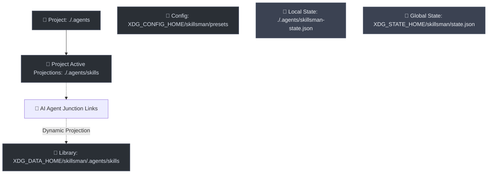

# 🛠️ skillsman

[](https://nodejs.org/)
[](package.json)
[](https://github.com/AlexRadch/skillsman/actions/workflows/test.yml)
[](LICENSE)
[](https://github.com/AlexRadch/skillsman)

`skillsman` is a lightweight, high-performance Node.js CLI utility designed to manage, structure, and dynamically swap presets (assemblies) of portable **AI Agent Skills** conforming to the Anthropic Agent Skills specification.

By acting as a **Unified CLI wrapper** and drop-in enhancement for the official `skills` tool, `skillsman` lets you use the standard `skills` commands while supercharging them with native preset management, directory isolation, and zero-conflict link management.

---

## 🗺️ Architecture and Concept

`skillsman` acts as a smart, zero-conflict projection layer between your physical skills store and active AI agents (like Claude Code, Cursor, Cline, Copilot, etc.), strictly conforming to the cross-platform **XDG Base Directory Specification**.

It defaults to **Local Project Scope** to isolate workspaces, with an option to toggle **Global Scope** via `-g / --global`:



### 📍 Paths Resolution Table

| Directory Type | Scope | Linux / macOS Default | Windows Default | Environment Variable |
| :--- | :--- | :--- | :--- | :--- |
| **Presets (Config)** | Global | `~/.config/skillsman/presets/` | `AppData\Roaming\skillsman\presets\` | `XDG_CONFIG_HOME` |
| **Active State File** | Global (`-g`) | `~/.local/state/skillsman/state.json` | `AppData\Local\skillsman\state.json` | `XDG_STATE_HOME` |
| **Active State File** | Local (Default) | `./.agents/skillsman-state.json` | `./.agents/skillsman-state.json` | *Fixed Local Path* |
| **Skills Library (Data)** | Global | `~/.local/share/skillsman/.agents/skills/` | `AppData\Local\skillsman\.agents\skills\` | `XDG_DATA_HOME` |
| **Active Projections** | Global (`-g`) | `~/.agents/skills/` | `~/.agents/skills/` | *Fixed Global Zone* |
| **Active Projections** | Local (Default) | `./.agents/skills/` | `./.agents/skills/` | *Fixed Local Zone* |

---

## 💎 Key Features

* 🚀 **10x Faster Execution**: Delegated commands run directly through Node.js on the compiled dependency bundle, bypassing `npx` and network/shell overhead entirely.
* 📦 **Automatic Skill Ingestion**: Scanning and migrating physical skill folders into the isolated library on-the-fly, generating clean presets automatically.
* 🔄 **Cycle-Safe DFS Traversal**: Resolving nested preset dependencies recursively using a cycle-safe Depth-First Search algorithm.
* 🤝 **Conflict Resolution**: Preventing breaking linkages when multiple active presets share identical skill names.
* 🚫 **Global Blacklist Priority**: Applying the designated `never.md` preset as a final filter block to prevent forbidden skills from projecting.
* 🤖 **Multi-Agent Targeting**: Every preset command accepts `-a / --agent <agent...>` to operate independently on 50+ supported AI agents (`claude-code`, `cursor`, `codex`, `aider-desk`, …), each with its own isolated state and skill projection.

---

## 📚 Documentation Directory

Technical details and developer instructions have been separated into dedicated guides:

* 📘 [**User Guide** (docs/user_guide.md)](docs/user_guide.md) — Directory layout, CLI command reference syntax, DFS resolver, conflict overrides, and how `never.md` blacklisting priority is applied.
* 💻 [**Developer Guide** (docs/developer_guide.md)](docs/developer_guide.md) — Local development, production dependencies, modular programmatic API (`index.js`), test architecture, and built-in **Node.js Native Test Runner** (`node:test`) details.

---

## ⚡ Quick Start

### 1. Installation

Install `skillsman` globally from NPM. This registers both global `skillsman` and `skills` executables on your system:

```bash
npm install -g skillsman
```

If you ever install the official CLI and it overwrites the commands, simply run `npm install -g skillsman` to route them back through `skillsman` safely.

### 2. Ingest Existing Skills

Scan and migrate physical skill folders from your active agent directory (`~/.agents/skills/`) to your isolated local library:

```bash
skillsman collect
```

This automatically generates a matching preset file under your config folder for every migrated skill.

### 3. List Available Presets

List all pre-built assemblies with their descriptions and unique resolved skill counts:

```bash
skillsman presets
```

### 4. Activate Presets

* **Absolute Activation**: Link only specific presets (e.g. `dev` and `planning`):

    ```bash
    skillsman use dev planning
    ```

* **Incremental Activation**: Add or remove skills from active sets on-the-fly:

    ```bash
    skillsman activate docs
    skillsman deactivate marketing
    # Or shorthand syntax:
    skillsman use +docs -marketing
    ```

* **Force Synchronization**: Sync active folder symlinks to match the exact current configuration of `state.json` (great after manually editing preset files):

    ```bash
    skillsman use
    ```

### 5. Target Specific AI Agents

Every preset command accepts the `-a / --agent` flag to operate on one or more specific agents instead of the default (`~/.agents/skills/`):

```bash
# Show status for claude-code and cursor
skillsman status -a claude-code cursor

# Activate "dev" preset for aider-desk only
skillsman use dev -a aider-desk

# Apply preset to multiple agents at once (space-separated or repeated flags)
skillsman use planning -a replit aider-desk -a codex

# Collect physical skills from a specific agent's directory
skillsman collect -a cursor
```

> [!NOTE]
> Agent names must exactly match the supported registry (e.g. `claude-code`, `cursor`, `aider-desk`). Comma-joined values like `replit,aider-desk` are rejected with `Error: Invalid agent: replit,aider-desk`.

---

## 🤖 Supported Agents

Skills can be managed for any of these agents via the `-a / --agent` flag:

| Agent | `--agent` | Global Path |
| ----- | --------- | ----------- |
| AiderDesk | `aider-desk` | `~/.aider-desk/skills/` |
| Amp, Kimi Code CLI, Replit, Universal | `amp`, `kimi-cli`, `replit`, `universal` | `~/.config/agents/skills/` |
| Antigravity | `antigravity` | `~/.gemini/antigravity/skills/` |
| Augment | `augment` | `~/.augment/skills/` |
| IBM Bob | `bob` | `~/.bob/skills/` |
| Claude Code | `claude-code` | `~/.claude/skills/` |
| OpenClaw | `openclaw` | `~/.openclaw/skills/` |
| Cline, Dexto, Warp | `cline`, `dexto`, `warp` | `~/.agents/skills/` |
| CodeArts Agent | `codearts-agent` | `~/.codeartsdoer/skills/` |
| CodeBuddy | `codebuddy` | `~/.codebuddy/skills/` |
| Codemaker | `codemaker` | `~/.codemaker/skills/` |
| Code Studio | `codestudio` | `~/.codestudio/skills/` |
| Codex | `codex` | `~/.codex/skills/` |
| Command Code | `command-code` | `~/.commandcode/skills/` |
| Continue | `continue` | `~/.continue/skills/` |
| Cortex Code | `cortex` | `~/.snowflake/cortex/skills/` |
| Crush | `crush` | `~/.config/crush/skills/` |
| Cursor | `cursor` | `~/.cursor/skills/` |
| Deep Agents | `deepagents` | `~/.deepagents/agent/skills/` |
| Devin for Terminal | `devin` | `~/.config/devin/skills/` |
| Droid | `droid` | `~/.factory/skills/` |
| Firebender | `firebender` | `~/.firebender/skills/` |
| ForgeCode | `forgecode` | `~/.forge/skills/` |
| Gemini CLI | `gemini-cli` | `~/.gemini/skills/` |
| GitHub Copilot | `github-copilot` | `~/.copilot/skills/` |
| Goose | `goose` | `~/.config/goose/skills/` |
| Hermes Agent | `hermes-agent` | `~/.hermes/skills/` |
| iFlow CLI | `iflow-cli` | `~/.iflow/skills/` |
| Junie | `junie` | `~/.junie/skills/` |
| Kilo Code | `kilo` | `~/.kilocode/skills/` |
| Kiro CLI | `kiro-cli` | `~/.kiro/skills/` |
| Kode | `kode` | `~/.kode/skills/` |
| MCPJam | `mcpjam` | `~/.mcpjam/skills/` |
| Mistral Vibe | `mistral-vibe` | `~/.vibe/skills/` |
| Mux | `mux` | `~/.mux/skills/` |
| OpenCode | `opencode` | `~/.config/opencode/skills/` |
| OpenHands | `openhands` | `~/.openhands/skills/` |
| Pi | `pi` | `~/.pi/agent/skills/` |
| Qoder | `qoder` | `~/.qoder/skills/` |
| Qwen Code | `qwen-code` | `~/.qwen/skills/` |
| Rovo Dev | `rovodev` | `~/.rovodev/skills/` |
| Roo Code | `roo` | `~/.roo/skills/` |
| Tabnine CLI | `tabnine-cli` | `~/.tabnine/agent/skills/` |
| Trae | `trae` | `~/.trae/skills/` |
| Trae CN | `trae-cn` | `~/.trae-cn/skills/` |
| Windsurf | `windsurf` | `~/.codeium/windsurf/skills/` |
| Zencoder | `zencoder` | `~/.zencoder/skills/` |
| Neovate | `neovate` | `~/.neovate/skills/` |
| Pochi | `pochi` | `~/.pochi/skills/` |
| AdaL | `adal` | `~/.adal/skills/` |

> [!NOTE]
> Agents sharing the same global path (e.g. `amp`, `kimi-cli`, `replit`, `universal`) share a single entry in `state.json` under the key `config_agents`. Activating a preset for any of them updates the shared state.

---

## 📝 License

Distributed under the [MIT](LICENSE) License. Copyright (c) 2026 Alexander Radchenko.
